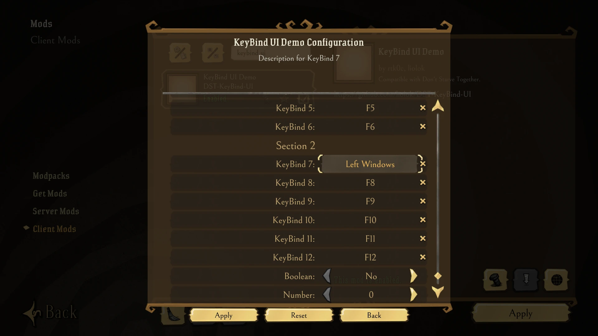
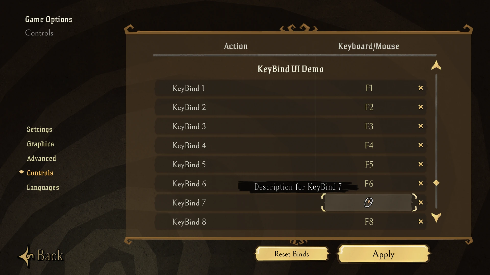

# KeyBind UI Refined for Don't Starve Together Mods

English | [中文](./README.zh.md)

Easy and quick key binding single-file lib for your mod.

Comparing to vanilla mod options, how does it improve user experience:

- Click on option to popup a dialog, then just press the key you want to bind. No more endless switching between options.
- Beside mod options, also support hot-rebind in "Settings > Controls". No need of restarting game.

What keys does it support:

- Almost all of the keys including number pad
- Mouse middle button and two side buttons

## Screenshots

### Mod Option




### Controls Page of Settings

Scroll down the option list, all mods' options are sorted after vanilla options.



## Quick Start

In `modinfo.lua`, define all the keys you wanna support. This simple example doesn't support mouse but has number pad:

```lua
local keyboard = { -- from STRINGS.UI.CONTROLSSCREEN.INPUTS[1] of strings.lua, need to match constants.lua too.
  { 'F1', 'F2', 'F3', 'F4', 'F5', 'F6', 'F7', 'F8', 'F9', 'F10', 'F11', 'F12', 'Print', 'ScrolLock', 'Pause' },
  { '1', '2', '3', '4', '5', '6', '7', '8', '9', '0' },
  { 'A', 'B', 'C', 'D', 'E', 'F', 'G', 'H', 'I', 'J', 'K', 'L', 'M' },
  { 'N', 'O', 'P', 'Q', 'R', 'S', 'T', 'U', 'V', 'W', 'X', 'Y', 'Z' },
  { 'Escape', 'Tab', 'CapsLock', 'LShift', 'LCtrl', 'LSuper', 'LAlt' },
  { 'Space', 'RAlt', 'RSuper', 'RCtrl', 'RShift', 'Enter', 'Backspace' },
  { 'Tilde', 'Minus', 'Equals', 'LeftBracket', 'RightBracket', 'Backslash', 'Semicolon', 'Period', 'Slash' }, -- punctuation
  { 'Up', 'Down', 'Left', 'Right', 'Insert', 'Delete', 'Home', 'End', 'PageUp', 'PageDown' }, -- navigation
}
local numpad = { '0', '1', '2', '3', '4', '5', '6', '7', '8', '9', 'Period', 'Divide', 'Multiply', 'Minus', 'Plus' }
local key_disabled = { description = 'Disabled', data = 'KEY_DISABLED' }
keys = { key_disabled }
for i = 1, #keyboard do
  for j = 1, #keyboard[i] do
    local key = keyboard[i][j]
    keys[#keys + 1] = { description = key, data = 'KEY_' .. key:upper() }
  end
  keys[#keys + 1] = key_disabled
end
for i = 1, #numpad do
  local key = numpad[i]
  keys[#keys + 1] = { description = 'Numpad ' .. key, data = 'KEY_KP_' .. key:upper() }
end
```

Then add a configuration:

```lua
configuration_options = {
  {
    name = 'keybind_1', -- config name for mod developer
    label = 'KeyBind 1', -- config name for player
    hover = 'Description for KeyBind 1', -- description for player
    default = 'KEY_F1', -- default key
    options = keys, -- all keys
  },
}
```

> Note: For `default`, select a `data` from `keys`.
>
> For example, use `default = 'KEY_DISABLED'` to bind no key by default.

Copy `keybind.lua` of this repository to your mod folder, import it and implement actual logic in `modmain.lua`:

```lua
modimport('keybind') -- relative path of keybind.lua

local function YourFn() print('Do your things here!') end

local handler = nil -- key event handlers

function KeyBind(_, key)
  if handler then handler:Remove() end -- disable old binding
  handler = key and GLOBAL.TheInput:AddKeyDownHandler(key, YourFn) or nil -- new binding or delete
end
```

> Note: First argument of function `KeyBind` is config name, in this case we only bind one key so no need of it.
>
> For more complex usage, such as multiple bindings and mouse button, see `modinfo.lua` and `modmain.lua` in this repository.

## Credit

This is my fork of rtk0c's [KeybindMagic](https://github.com/rtk0c/dont-starve-mods/tree/master/KeybindMagic),
mod configuration injection part was originally adapted from Tony's [Lazy Controls](https://steamcommunity.com/sharedfiles/filedetails/?id=2111412487) by me.
