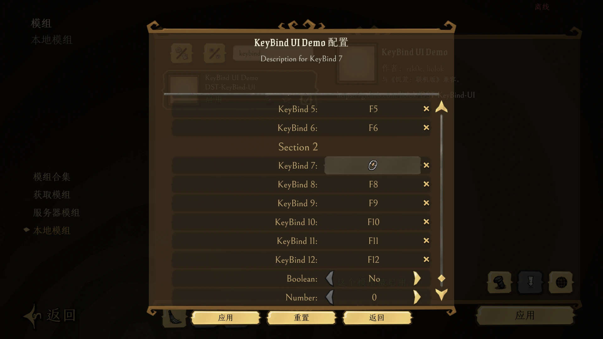
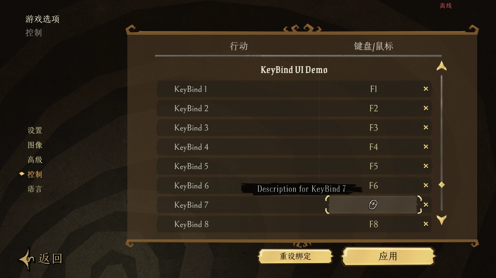

# 饥荒联机模组键位绑定交互优化

[English](./README.md) | 中文

简单方便的模组键位绑定单文件代码库。

相比原生的模组设置，体验有哪些改善：

- 点击选项后弹窗，直接按键即可绑定。无需在一大堆键位选项之间左右切换。
- 在模组设置之外，还支持在游戏内「设置 > 控制」页面更改键位。实时生效，无需重启游戏。

支持哪些键位：

- 包含数字小键盘在内的几乎所有按键
- 鼠标中键和两个侧键

## 示例截图

### 模组设置




### 游戏设置的控制页面

位于配置列表的下方，所有模组对应的按键绑定配置都排在游戏原生配置之后。



## 快速上手

在 `modinfo.lua` 中，定义想要支持的键位。本简单示例未添加鼠标的支持，但支持了小键盘。

```lua
local keyboard = { -- from STRINGS.UI.CONTROLSSCREEN.INPUTS[1] of strings.lua, need to match constants.lua too.
  { 'F1', 'F2', 'F3', 'F4', 'F5', 'F6', 'F7', 'F8', 'F9', 'F10', 'F11', 'F12', 'Print', 'ScrolLock', 'Pause' },
  { '1', '2', '3', '4', '5', '6', '7', '8', '9', '0' },
  { 'A', 'B', 'C', 'D', 'E', 'F', 'G', 'H', 'I', 'J', 'K', 'L', 'M' },
  { 'N', 'O', 'P', 'Q', 'R', 'S', 'T', 'U', 'V', 'W', 'X', 'Y', 'Z' },
  { 'Escape', 'Tab', 'CapsLock', 'LShift', 'LCtrl', 'LSuper', 'LAlt' },
  { 'Space', 'RAlt', 'RSuper', 'RCtrl', 'RShift', 'Enter', 'Backspace' },
  { 'BackQuote', 'Minus', 'Equals', 'LeftBracket', 'RightBracket' },
  { 'Backslash', 'Semicolon', 'Quote', 'Period', 'Slash' }, -- punctuation
  { 'Up', 'Down', 'Left', 'Right', 'Insert', 'Delete', 'Home', 'End', 'PageUp', 'PageDown' }, -- navigation
}
local numpad = { '0', '1', '2', '3', '4', '5', '6', '7', '8', '9', 'Period', 'Divide', 'Multiply', 'Minus', 'Plus' }
local key_disabled = { description = 'Disabled', data = 'KEY_DISABLED' }
keys = { key_disabled }
for i = 1, #keyboard do
  for j = 1, #keyboard[i] do
    local key = keyboard[i][j]
    keys[#keys + 1] = { description = key, data = 'KEY_' .. key:upper() }
  end
  keys[#keys + 1] = key_disabled
end
for i = 1, #numpad do
  local key = numpad[i]
  keys[#keys + 1] = { description = 'Numpad ' .. key, data = 'KEY_KP_' .. key:upper() }
end
```

然后添加一个配置：

```lua
configuration_options = {
  {
    name = 'keybind_1', -- 开发者用的配置名称
    label = 'KeyBind 1', -- 玩家看到的配置名称
    hover = 'Description for KeyBind 1', -- 玩家看到的配置描述
    default = 'KEY_F1', -- 默认键位
    options = keys, -- 所有键位选择
  },
}
```

> 说明：`default` 应在 `keys` 的 `data` 中选择一个。
>
> 例如 `default = 'KEY_DISABLED'` 表示默认不绑定任何键位。

将本仓库内的 `keybind.lua` 复制到你的模组目录，然后在 `modmain.lua` 中导入并实现业务逻辑：

```lua
modimport('keybind') -- keybind.lua 实际所在的相对路径

local function YourFn() print('键位绑定的业务逻辑代码') end

local handler = nil -- 按键事件处理器

function KeyBind(_, key)
  if handler then handler:Remove() end -- 禁用旧绑定
  handler = key and GLOBAL.TheInput:AddKeyDownHandler(key, YourFn) or nil -- 新建绑定或无绑定
end
```

> 说明：函数 `KeyBind` 的第一个参数是配置名称，此处由于我们只绑定了一个键位所以不需要它。
>
> 对于更复杂的绑定，比如多个键位、鼠标侧键中键，请参考本仓库的 `modinfo.lua` 和 `modmain.lua`。

## 致谢

原版是 rtk0c 的 [KeybindMagic](https://github.com/rtk0c/dont-starve-mods/tree/master/KeybindMagic)，
模组配置注入部分起初由我从 Tony 的 [Lazy Controls](https://steamcommunity.com/sharedfiles/filedetails/?id=2111412487) 改版而来。
